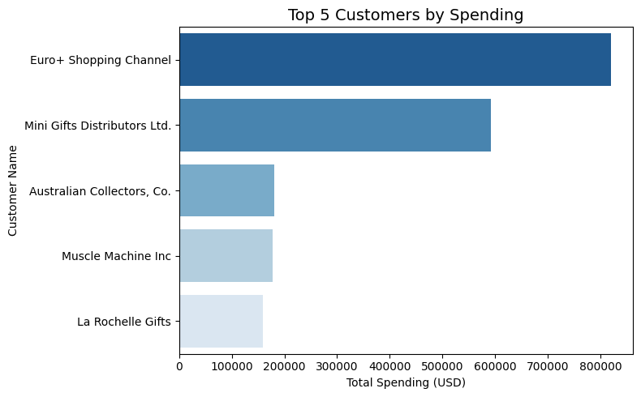

# SQL-Analysis-Project
This project demonstrates advanced SQL querying skills using the MyDB dataset. The focus is on complex filtering techniques and subqueries to extract meaningful business insights from multiple related tables.
# 📊MyDB Sales Analysis – MySQL Project

## 📌 Project Overview
This project is a **beginner-to-intermediate level SQL portfolio project** built using the **MyDB** sample database Downloaded From Public Domain.  
It demonstrates **Advanced Filtering, Subqueries, Joins, and Aggregations** to extract meaningful business insights from sales data.

The goal of this project was to:
- Strengthen SQL skills with real-world-style queries.
- Explore customer, order, and product data to uncover trends.
- Practice creating **data visualizations** from SQL query results.
- Build a complete project that can be shared on **GitHub** and LinkedIn.

---

## 🗂 Dataset Information
The **Classic Models** database is a sample dataset containing:
- **Customers** – Customer details including location.
- **Orders** – Order information with dates and statuses.
- **OrderDetails** – Item-level details for each order.
- **Products** – Product catalog with categories and pricing.
- **Employees** – Employee information including sales reps.
- **Offices** – Locations of offices worldwide.
- **Payments** – Payment transactions from customers.
  Dataset Link : https://www.mysqltutorial.org/wp-content/uploads/2023/10/mysqlsampledatabase.zip

**Database ER Diagram** 

---

## 🛠 Tools & Technologies Used
- **MySQL** – Data storage and querying.
- **Jupyter Notebook** – Running and documenting SQL queries with explanations.
- **Python** (`ipython-sql`) – Integrating SQL directly into notebook cells.
- **Matplotlib & Seaborn** – Data visualization from SQL outputs.
- **Pandas** – Data manipulation after fetching SQL results.

---

## 📌 Key SQL Concepts Covered
- Basic to Advanced **Filtering** (`WHERE`, `BETWEEN`, `LIKE`, `IN`)
- **Aggregate Functions** (`COUNT`, `SUM`, `AVG`, etc.)
- **Joins** (`INNER`, `LEFT`, `RIGHT`)
- **Subqueries** (Single-row & multi-row)
- **GROUP BY & HAVING** for grouped filtering
- Ordering & limiting results
- Combining **SQL + Python** for visualization

---

## 📈 Project Workflow
1. **Database Connection** – Connected MySQL with Jupyter Notebook using `ipython-sql`.
2. **Data Exploration** – Basic queries to understand data structure.
3. **Advanced Filtering & Subqueries** – Extracting meaningful insights.
4. **Data Visualization** – Creating plots for better understanding.
5. **Conclusion & Insights** – Summarizing key findings.

---

## 🔍 Key Queries & Insights
- **Top Customers by Total Order Value**
- **Countries with the Highest Sales**
- **Most Popular Product Categories**
- **Monthly Sales Trends**
- **High-Value Orders Filtering**
- **Customers with No Recent Orders**
- **Top Sales Representatives by Region**

---

## 📊 Visualizations Created
1. **Top 10 Customers by Order Value** – Bar chart
2. **Sales Distribution by Country** – Pie chart
3. **Monthly Sales Trends** – Line chart
4. **Top 5 Product Categories by Revenue** – Horizontal bar chart

Example:  

---

## 📌 Conclusion & Summary
- **North America** and **Europe** contributed the largest share of total revenue.
- A small number of customers contribute to a large percentage of sales (**Pareto principle** observed).
- Certain product lines such as **Classic Cars** and **Vintage Cars** dominate sales.
- Seasonal trends show **peak sales months**, helping in inventory planning.
- Identified **inactive customers**, potential targets for re-engagement campaigns.

---

